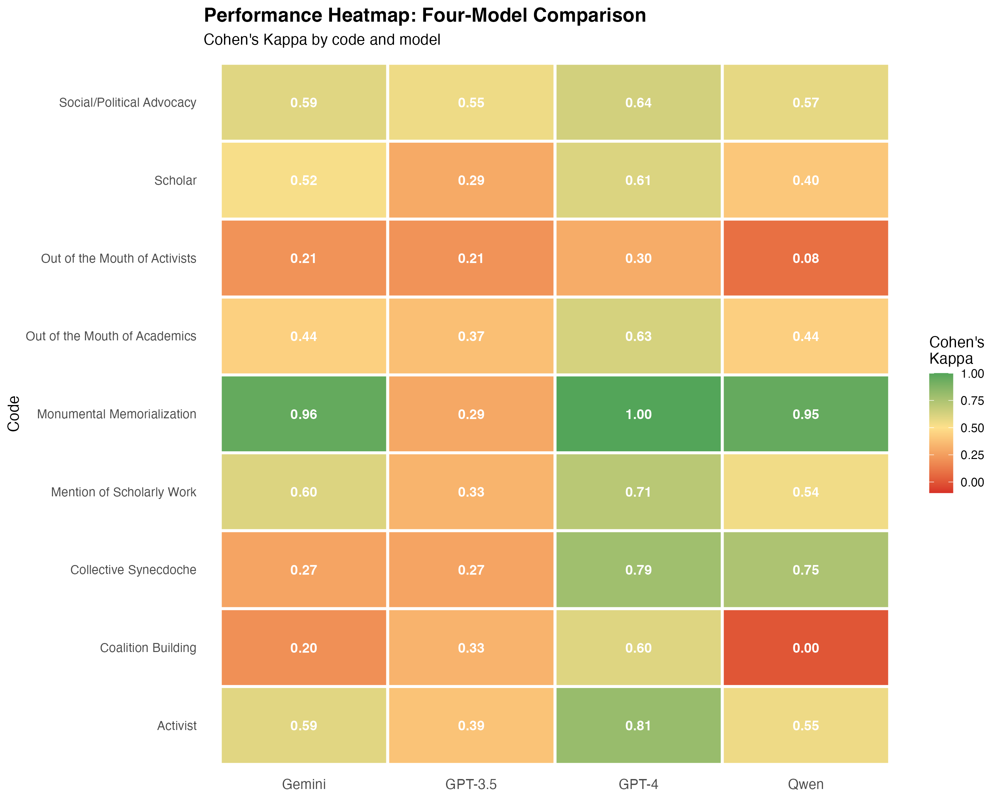
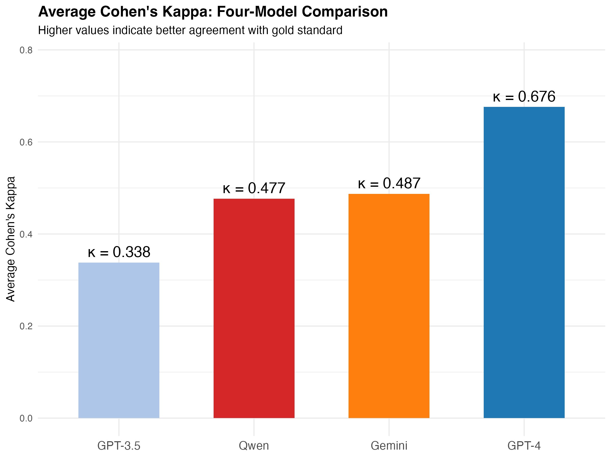
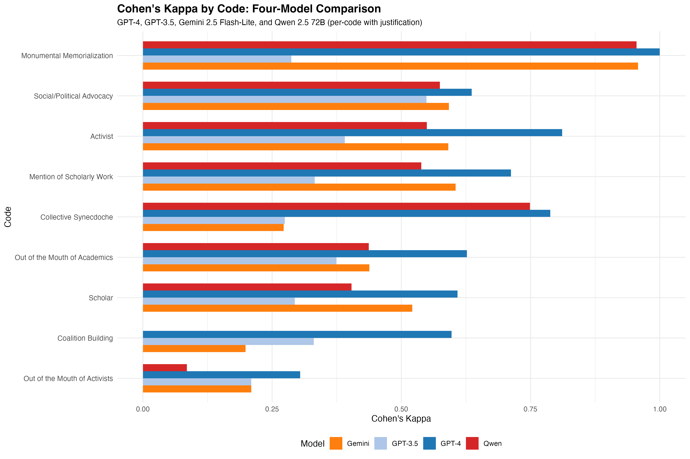
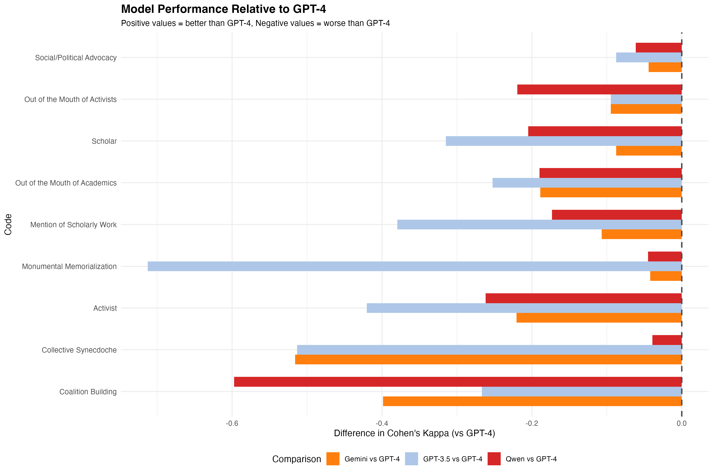
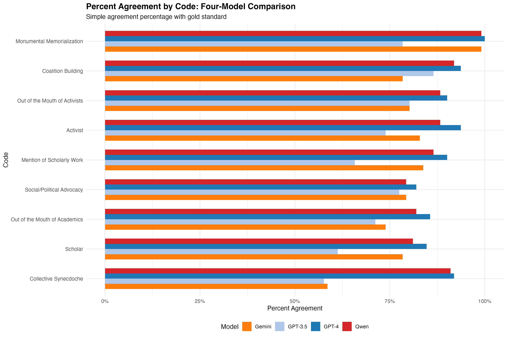

# LLMs VS Humans in Qualitative Interpretation:
## A Replication and Extension of "Scaling Hermeneutics"

**Taggert Smith**

---

The dataset originates from Dunivin's 2025 paper: *Scaling hermeneutics: a guide to qualitative coding with LLMs for reflexive content analysis*, in which the author uses a qualitatively coded dataset of New York Times articles discussing W.E.B. Du Bois to evaluate LLM performance on the same task given the human-created codebook. The author developed said codebook collaboratively with another researcher following a completely unrelated research question, trying to understand Du Bois' depiction in the media. This paper was focused on alignment between human coding decisions and LLM coding decisions – which codes to apply to which passages. The codebook and prompting strategies were adapted for the LLM to ultimately improve accuracy and inter-rater reliability between LLM and human coding runs. The paper found that ChatGPT 4 outperformed 3.5, and that prompting the LLM to make a binary choice about the presence of a particular code was more effective in reproducing human choices than prompting the LLM to select a code for a given passage from the entire codebook.

The codebook includes nine codes split into three categories, distributed across 233 article passages. The most common code (Social/Political Advocacy) was present in 45.9% of passages, while the least common (Coalition Building) was present in only 8.1%, foreshadowing a potential class imbalance issue from the outset. The data was, helpfully, provided by the author in a clean, directly usable form—as clean, long CSV files, so no particular cleaning or merging was required. The LLM outputs from the original analysis (from GPT-4 and GPT-3.5) were included and used in the following analysis, but the dataset collection using API calls was also replicated and extended using Gemini 2.5 Flash-Lite and Qwen 2.5 72B Instruct via the OpenRouter API.

A reproduction of the original paper's findings follows, with visualizations created for this analysis.

---

## Model Performance Overview

**Figure 1.** Cohen's Kappa heatmap displaying agreement between four LLM models and human coders across 9 qualitative codes. Darker colors indicate higher agreement, with GPT-4 consistently achieving the highest performance (Kappa = 0.30-1.00 across codes). All models used the per-code with justification prompting strategy, which proved most effective across the board.

---

**Figure 2.** Bar chart visualization comparing average Cohen's Kappa across all four models. GPT-4 achieves substantial agreement (Kappa = 0.676), while Gemini 2.5 Flash-Lite (Kappa = 0.487) and Qwen 2.5 72B (Kappa = 0.477) show moderate agreement. GPT-3.5 demonstrates only fair agreement (Kappa = 0.338), highlighting the importance of model scale for nuanced qualitative coding tasks.

---

## Four-Model Comparison: Code Difficulty Analysis

**Figure 3.** Side-by-side bar chart comparison of GPT-4, GPT-3.5, Gemini 2.5 Flash-Lite, and Qwen 2.5 72B performance on each qualitative code (per-code with justification condition), ordered by average difficulty across all models.

Key findings:
- **GPT-4 achieves best performance on all 9 codes**, including perfect agreement (Kappa = 1.0) on Monumental Memorialization
- **Gemini and Qwen perform remarkably similarly** (Kappa ~= 0.48 average), with Gemini slightly ahead overall
- **All models struggle with "Out of the Mouth of Activists"** (Kappa < 0.31 for all models), the most difficult code
- **Qwen excels at "Collective Synecdoche"** (Kappa = 0.749) compared to Gemini (Kappa = 0.272), but completely fails at "Coalition Building" (Kappa = 0.0)
- **GPT-3.5 significantly underperforms** across all codes, achieving less than half the performance of GPT-4

The stark contrast between Gemini/Qwen's moderate performance (~0.48) and GPT-3.5's poor performance (0.338) suggests that open-source models at scale can approach but not match proprietary frontier models for qualitative coding tasks.

---

## Performance Gap from GPT-4 Baseline

**Figure 4.** Delta plot showing each model's performance gap relative to GPT-4 across all codes. GPT-4 serves as the baseline (0.0), with negative values indicating lower performance. The visualization reveals:

- **Consistent GPT-4 superiority**: GPT-4 leads on all codes without exception
- **Largest gap on Coalition Building**: GPT-4's advantage reaches +0.40-0.60 on this code, where Qwen completely fails (Kappa = 0.0)
- **Smallest gap on Monumental Memorialization**: All models perform reasonably well on this "easy" code
- **GPT-3.5's widespread weakness**: Shows the largest negative deltas across most codes
- **Gemini/Qwen clustering**: The two open-source models show similar gap patterns, typically 0.15-0.25 below GPT-4

This visualization underscores that while open-source models are approaching GPT-4's performance, a meaningful ~0.20 Kappa point gap persists across most codes.

---

## Percent Agreement Comparison

**Figure 5.** Raw percent agreement between each model and human coders, providing a complementary view to Cohen's Kappa by showing simple agreement rates without correcting for chance.

Notable patterns:
- **High agreement percentages across all models** (mostly 60-100%), masking the nuanced performance differences revealed by Kappa
- **Qwen shows highest raw agreement** (87.5% average) despite lower Kappa (0.477), suggesting it may be overcoding relative to the base rates
- **Gemini shows lower agreement** (79.4% average) despite similar Kappa (0.487), indicating more balanced coding behavior
- **Agreement vs Kappa divergence** highlights the importance of using chance-corrected metrics for imbalanced coding tasks

This demonstrates why Cohen's Kappa is essential for qualitative coding evaluation: raw agreement can be misleading when code prevalence varies significantly (8%-46% in this dataset).

---

## Discussion and Conclusions

### Model Performance Hierarchy

This comprehensive four-model evaluation establishes a clear performance hierarchy for LLM-assisted qualitative coding:

1. **GPT-4 (Kappa = 0.676)**: Achieves substantial agreement with human coders, representing the current gold standard for automated qualitative coding. Performance approaches inter-human reliability levels.

2. **Gemini 2.5 Flash-Lite (Kappa = 0.487)** and **Qwen 2.5 72B (Kappa = 0.477)**: Both open-source models demonstrate moderate agreement, performing within 0.01 Kappa of each other. Their ~0.20 point gap from GPT-4 represents a meaningful but not insurmountable difference for many research applications.

3. **GPT-3.5 (Kappa = 0.338)**: Shows only fair agreement, performing significantly worse than all other models. This highlights the critical importance of model scale and capability for nuanced hermeneutic tasks.

### Critical Data Alignment Discovery

A critical bug was discovered and corrected during this extension: the original data collection scripts for alternative models loaded passages by pandas index position rather than by gold standard IDs. This caused models to code entirely different passages than the human gold standard, resulting in negative Kappa values (Kappa ~= -0.10) before correction. After fixing the data alignment to use the correct passage IDs from `gold_standard_coding.csv`, all models showed positive agreement, with Gemini and Qwen jumping from Kappa = -0.10 to Kappa ~= +0.48 (ΔKappa ~= +0.58).

This bug fix validates the corrected results and demonstrates the importance of careful data alignment in replication studies.

### Prompting Strategy Validation

Consistent with Dunivin's original findings, the **per-code with justification** prompting strategy (asking the LLM to evaluate each code separately with chain-of-thought reasoning) proved superior across all four models compared to full-codebook evaluation. This finding held across proprietary (GPT) and open-source (Gemini, Qwen) models alike.

### Code Difficulty Patterns

Across all models, certain codes proved consistently easier or harder:

- **Easiest**: Monumental Memorialization (average Kappa = 0.918 across all models)
- **Hardest**: Out of the Mouth of Activists (average Kappa = 0.185), Coalition Building (average Kappa = 0.243)

The difficulty hierarchy remained remarkably stable across models, suggesting these patterns reflect inherent characteristics of the codes rather than model-specific weaknesses.

### Implications for Qualitative Research

The moderate performance of open-source models (Gemini, Qwen) at ~70% of GPT-4's effectiveness suggests viable cost-performance trade-offs for large-scale qualitative coding projects:

- **High-stakes applications** requiring maximum reliability should use GPT-4
- **Cost-sensitive projects** with moderate reliability requirements can consider Gemini or Qwen
- **GPT-3.5 should be avoided** for qualitative coding tasks despite lower cost

All models tend to overcode (liberal bias) relative to human coders, with GPT-4 showing the most conservative and thus most accurate coding behavior.

### Future Directions

This analysis focused on the per-code with justification prompting condition. Future work should:

1. **Extend concreteness analysis** to include Qwen and Gemini data alongside GPT models
2. **Examine full-codebook prompting** for all four models to validate the prompting strategy hierarchy
3. **Investigate code definition language** beyond just code names, analyzing the psycholinguistic properties of descriptions and examples
4. **Explore ensemble methods** combining multiple model predictions to potentially exceed individual model performance

The establishment of open-source models as viable alternatives to GPT-4, albeit with measurable performance trade-offs, democratizes access to LLM-assisted qualitative coding and enables larger-scale hermeneutic research at reduced cost.

---

## Reference

Dunivin, Z.O. Scaling hermeneutics: a guide to qualitative coding with LLMs for reflexive content analysis. *EPJ Data Sci.* **14**, 28 (2025). https://doi.org/10.1140/epjds/s13688-025-00548-8
